# chroma-desktop

[](https://github.com/HollaFoil/chroma-desktop/releases)
[](https://github.com/HollaFoil/chroma-desktop/actions/workflows/checks.yml)


[](https://github.com/HollaFoil/chroma-desktop/commits/master)
[](https://github.com/HollaFoil/chroma-desktop/compare/master...staging)

A heavily opinionated Hyprland desktop where every single app live responds to your wallpaper's palette. Change the
wallpaper (`SUPER+W`) and matugen recolours the bar, notifications, launcher,
terminal, lock screen, GTK and Qt apps, Discord, Spotify, Steam, btop, the
shell prompt and the websites you visit in Firefox. 

Some awesome waybar/popup designs were heavily inspired by [Matuprland](https://github.com/Abhra00/Matuprland), thank you!

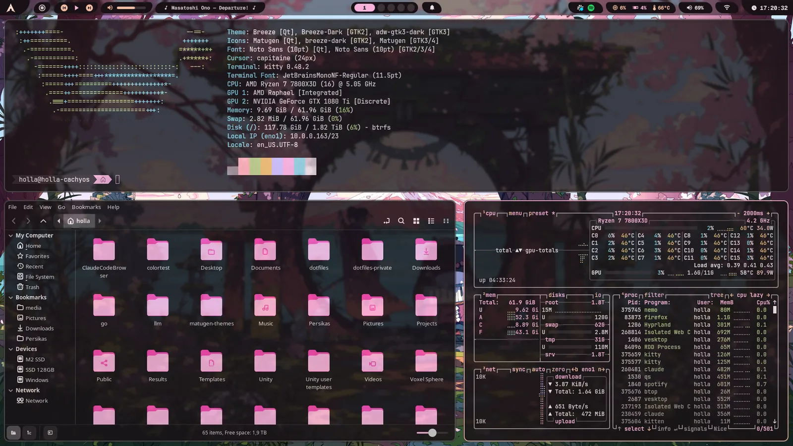

Same desktop, four wallpapers:

| | |
|---|---|
| 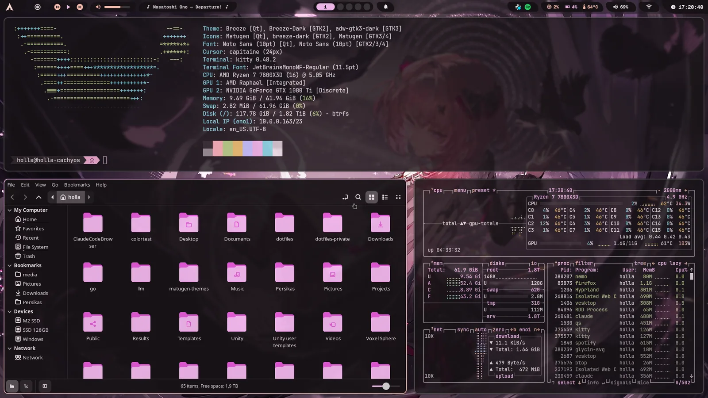 | 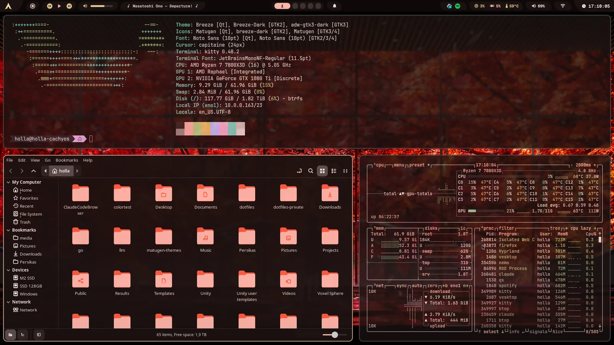 |
| 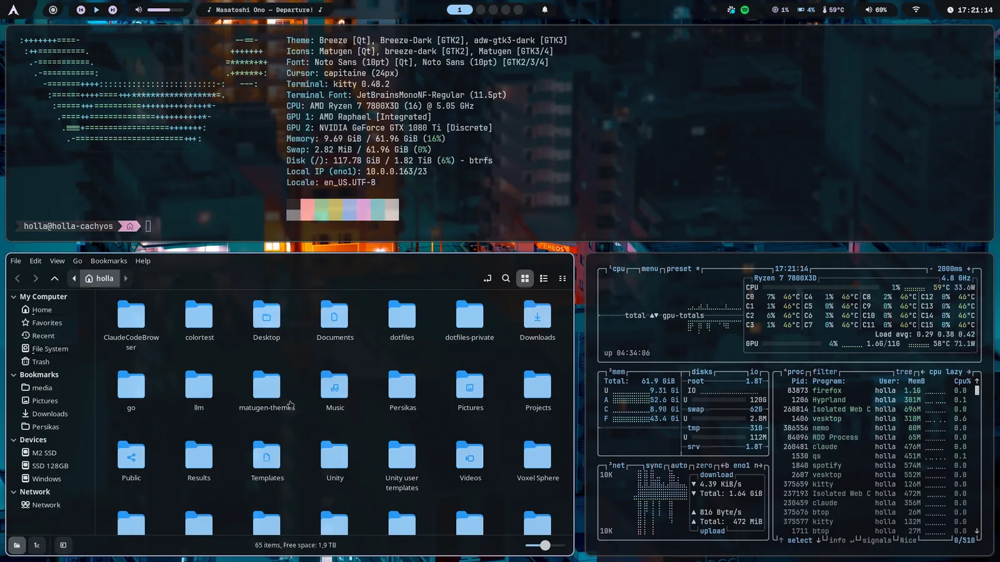 | 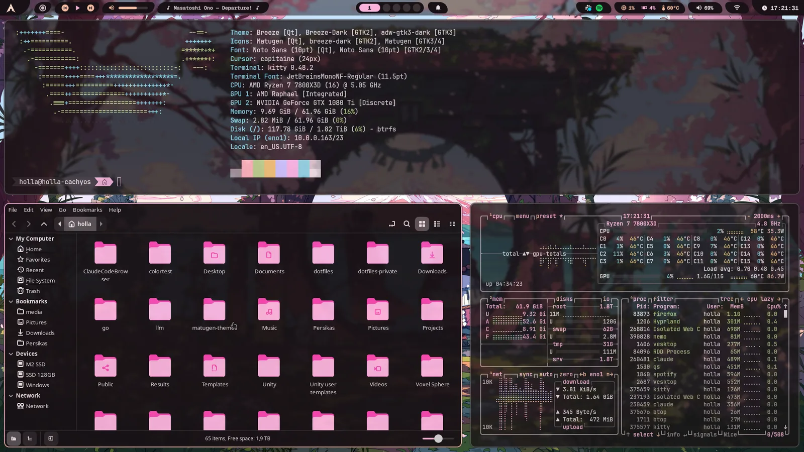 |

The shell is one Quickshell config: bar, launcher (`SUPER+R`), keybind
cheatsheet (`SUPER+/`), wallpaper strip (`SUPER+W`), notifications, clipboard
history, OSD, a Settings app, the lock screen and the login screen.

| Launcher | Cheatsheet |
|---|---|
| 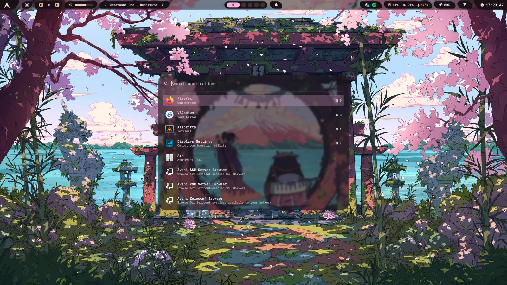 | 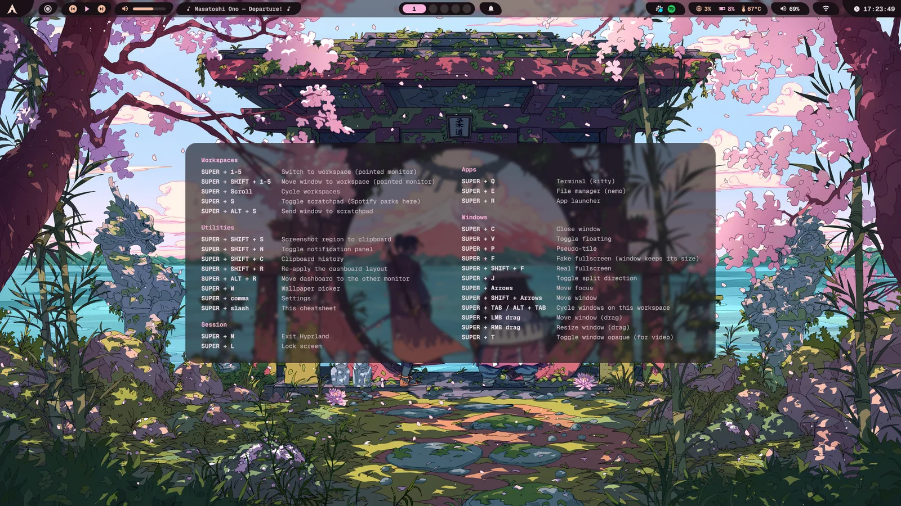 |
| **Wallpapers** | **Bar popups** |
| 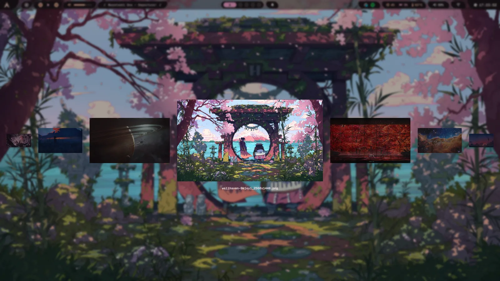 | 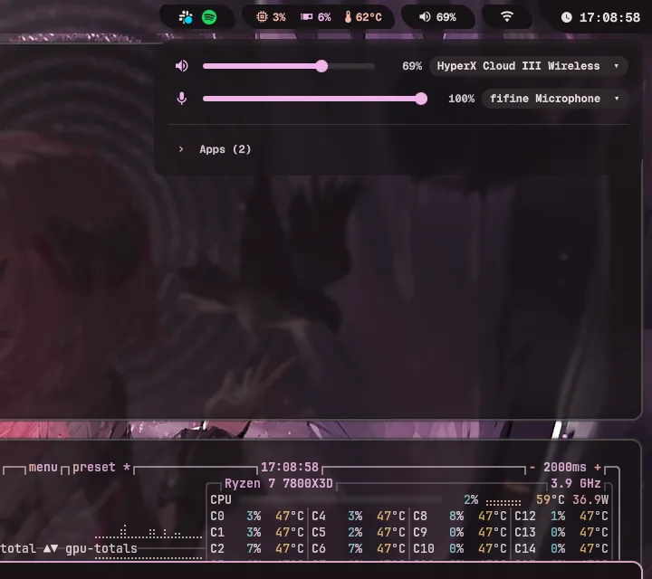 |

| Settings | |
|---|---|
| 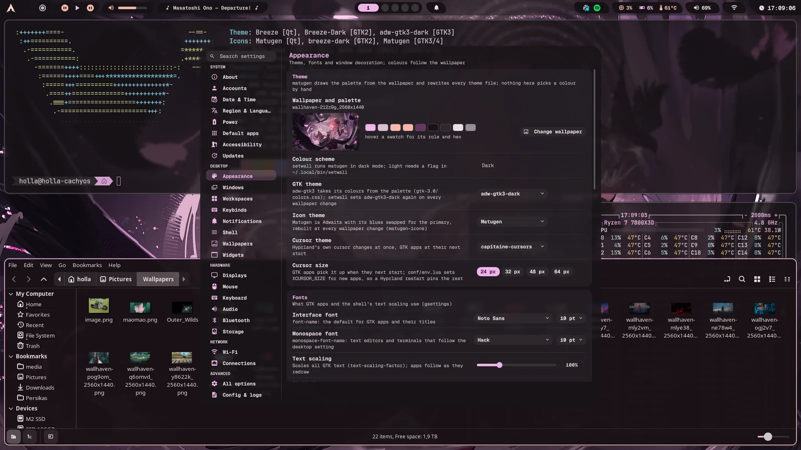 | 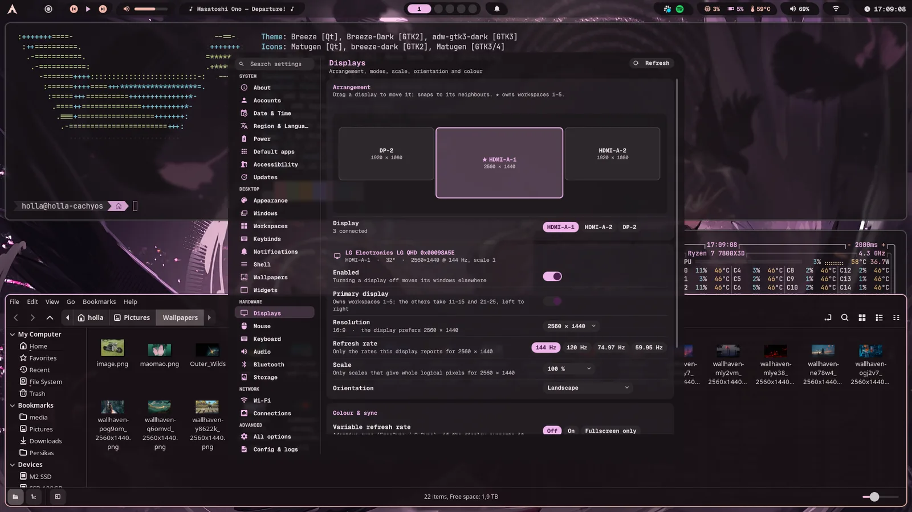 |
| **Lock screen** | |
|  | 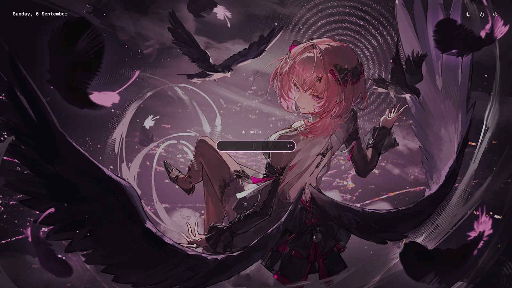 |

Hyprland is configured in **Lua** (`hypr/hyprland.lua`, needs Hyprland ≥ 0.56),
and everything worth tweaking is in **Settings** (Arch button, or `SUPER+,`).
Written for CachyOS/Arch.

## Install

Releases are tagged on `master`. Everything goes to `staging` first, and pull
requests go there too.

```sh
git clone https://github.com/HollaFoil/chroma-desktop ~/chroma-desktop
cd ~/chroma-desktop
./bootstrap --check                        # what is missing; changes nothing
./bootstrap --wallpaper ~/Pictures/some.png
```

`bootstrap` asks before each step: install the packages from `packages.txt`,
symlink `manifest.txt` into `~`, set up the themed apps you have, write your
monitors, make fish your shell, and apply the wallpaper so the colours exist
before your first login. Then log into Hyprland.

## Read this before you run it

This desktop is heavily opinionated and isn't really meant for others to use.
If you understand Arch, you should have no problems, however, do not expect
GUI settings to cover all possible topics, do not expect tons of personalization, etc.

There's some left over packages (tailscale, for example, since things like SSH are made VPN only here) which have integrations and
are in the install scripts. You can safely ignore/remove them if you do not have a use for them.

I will improve this repo as time goes on, perhaps one day it can be a standalone distro, but, for the time being,
this will be a relatively de-bloated and lean desktop.

Things in here that reach outside the repo, or may cause problems if your machine differs substantially:

- **Hyprland ≥ 0.56 is required.** The config is written in Lua. an older Hyprland cannot
  read it and you get a session with *no* config. `./bootstrap --check` spots this issue.
- **Your existing configs are moved** Anything in the way of a
  symlink goes to `backup-<timestamp>/` in the repo.
- **Steam's DevTools port.** `reload-steam-css` recolours the running Steam
  client through CEF remote debugging, which Steam hardcodes to **port 8080**
  and which bootstrap enables (`~/.steam/steam/.cef-enable-remote-debugging`).
  Anything else you run on 8080 will cause issues, and any local process can
  drive Steam's embedded browser while that flag exists. Delete the flag file
  if you do not want that.
- **`./prune --remove` uninstalls packages** (Dolphin, VLC, the Plasma
  desktop...). It is never run for you, and `./prune` alone only lists them.
- **`./greeter install` changes how you log in**: installs greetd, writes
  `/etc/greetd/*` and `/etc/pam.d/quickshell`, and by default boots straight
  into your locked desktop. The session exists before the password is typed,
  so use `--no-autologin` on a laptop. Nothing is switched until `./greeter enable`.
  If the login screen ever fails, `Ctrl+Alt+F2` is a text login and
  `./greeter disable` restores the previous display manager.
- **`./sshd install` opens SSH** on the Tailscale interface only, with password
  login until you `./sshd key` and flip `PasswordAuthentication`. Also opt-in.
- **`remote-desktop on` starts a VNC server** bound to your Tailscale address.
  Also opt-in, from the bar's network panel or the command.
- **The Displays page rewrites your monitor config** (`hypr/monitors.lua`).
  Risky changes revert after 15 s unless you keep them.
- **A Plasma leftover, `kde-gtk-config`, overwrites** `gtk-{3,4}.0/gtk.css`
  behind matugen's back. `./prune --remove` removes it and `./link` puts the
  symlinks back, if you ever encounter issues.
- **A few scripts target my hardware** and can fail elsewhere: the bar's CPU sensor
  path (`quickshell/Services/Stats.qml`, an AMD `k10temp` hwmon), the GPU
  module (`nvidia-smi`, shows `--` without it), `chrome-flags.conf` (NVIDIA
  workarounds), and `relayout`'s three-monitor dashboard, which stays unbound
  until you write `~/.config/relayout/config.sh`.

## Themed apps

matugen writes every app's colours on each `setwall <wallpaper path>`, dispatches live reload hooks where necessary.
`bootstrap` prints how to set up each app, and whether it is ready. Each app is optional.

| App | The one step |
|---|---|
| Steam | nothing. bootstrap installs Adwaita-for-Steam and the flag file above. |
| Spotify | spicetify: `current_theme = Text`, `color_scheme = matugen` in `config-xpui.ini`. |
| Discord (Vesktop) | turn on *Enable Custom CSS* in Vencord. |
| Firefox | the [MatugenFox](https://github.com/Ubaidullah-Web-Dev/MatugenFox) extension. Per-site CSS lives in `dusky_sites/`. |
| VSCodium / VS Code | the *Matugen Theme* extension (`haikalllp.matugen-theme`). |
| btop | `color_theme = "matugen"`. |
| GTK / Qt / KDE apps | nothing: adw-gtk3, qt6ct and `kdeglobals` are in the manifest. Qt apps recolour on relaunch. |
| Terminal prompt | oh-my-posh. bootstrap fetches the `agnoster` theme that gets recoloured. |
| Icons | nothing: a recoloured Adwaita is generated as `~/.local/share/icons/Matugen`. |

## Layout

```
manifest.txt   every file that gets symlinked into ~, one path per line
files/         the dotfiles, mirrored on ~   (files/.config/... -> ~/.config/...)
packages.txt   what to install and why
bootstrap      first-time setup            link / adopt   re-symlink / pull live files back in
prune          redundant packages           greeter        the login screen (greetd)
sshd           SSH over Tailscale           system/        files outside ~, installed by greeter and sshd
examples/      relayout.config.sh, hypr-user.lua: per-machine files that live outside the repo
screenshots    retakes the images above     hyprtest       moves windows around for ~3 min
```

Day to day: edit a file in `files/` and it is live, because everything is
symlinked. Templates apply on the next `setwall`. New config? Add its path to `manifest.txt`, `./adopt`,
`./link`. Machine-local Hyprland extras go in `~/.config/hypr/user/init.lua`
(see `examples/hypr-user.lua`). New monitors? `./bootstrap --monitors`.

Anything genuinely mine rather than the desktop's lives in a private overlay
repo that symlinks itself in on top of this one. `.gitignore` shows how.
