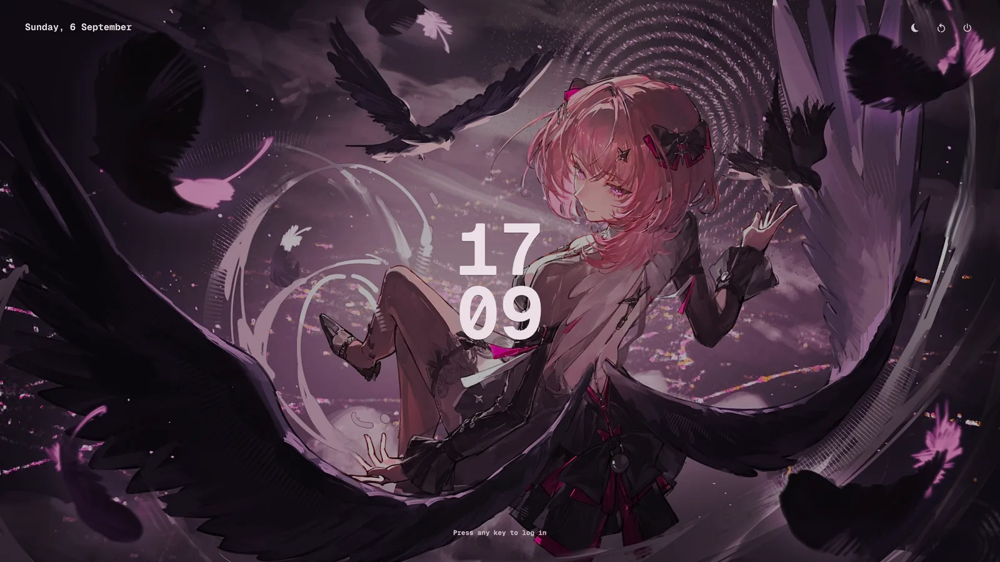

# dotfiles

A Hyprland desktop where every colour comes from the wallpaper. Change the
wallpaper (`SUPER+W`) and matugen recolours the bar, notifications, launcher,
terminal, lock screen, GTK and Qt apps, Discord, Spotify, Steam, btop, the
shell prompt and the websites you visit in Firefox. Live, no restarts.


Same desktop, four wallpapers:

| | |
|---|---|
|  |  |
|  |  |

The shell is one Quickshell config: bar, launcher (`SUPER+R`), keybind
cheatsheet (`SUPER+/`), wallpaper strip (`SUPER+W`), notifications, clipboard
history, OSD, a Settings app, the lock screen and the login screen.

| Launcher | Cheatsheet |
|---|---|
|  |  |
| **Wallpapers** | **Bar popups** |
|  |  |

| Settings | Displays |
|---|---|
|  |  |
| **Lock screen** | **Login screen** |
|  |  |

Hyprland is configured in **Lua** (`hypr/hyprland.lua`, needs Hyprland ≥ 0.56),
and everything worth tweaking is in **Settings** (Arch button, or `SUPER+,`).
Written for CachyOS/Arch.

## Install

```sh
git clone https://github.com/HollaFoil/dotfiles ~/dotfiles
cd ~/dotfiles
./bootstrap --check                        # what is missing; changes nothing
./bootstrap --wallpaper ~/Pictures/some.png
```

`bootstrap` asks before each step: install the packages from `packages.txt`,
symlink `manifest.txt` into `~`, set up the themed apps you have, write your
monitors, make fish your shell, and apply the wallpaper so the colours exist
before your first login. Then log into Hyprland.

## Read this before you run it

Things in here that reach outside the repo, or bite if your machine differs:

- **Hyprland ≥ 0.56 is required.** The config is Lua; an older Hyprland cannot
  read it and you get a session with *no* config. `./bootstrap --check` tells you.
- **Your existing configs are moved, not deleted.** Anything in the way of a
  symlink goes to `backup-<timestamp>/` in the repo.
- **Steam's DevTools port.** `reload-steam-css` recolours the running Steam
  client through CEF remote debugging, which Steam hardcodes to **port 8080**
  and which bootstrap enables (`~/.steam/steam/.cef-enable-remote-debugging`).
  Anything else you run on 8080 will fight with it, and any local process can
  drive Steam's embedded browser while that flag exists. Delete the flag file
  if you do not want that.
- **`./prune --remove` uninstalls packages** (Dolphin, VLC, the Plasma
  desktop...). It is never run for you; `./prune` alone only lists them.
- **`./greeter install` changes how you log in**: installs greetd, writes
  `/etc/greetd/*` and `/etc/pam.d/quickshell`, and by default boots straight
  into your locked desktop (the session exists before the password; use
  `--no-autologin` on a laptop). Nothing is switched until `./greeter enable`.
  If the login screen ever fails, `Ctrl+Alt+F2` is a text login and
  `./greeter disable` restores the previous display manager.
- **`./sshd install` opens SSH** on the Tailscale interface only, with password
  login until you `./sshd key` and flip `PasswordAuthentication`. Also opt-in.
- **`remote-desktop on` starts a VNC server** bound to your Tailscale address.
  Also opt-in, from the bar's network panel or the command.
- **The Displays page rewrites your monitor config** (`hypr/monitors.lua`).
  Risky changes revert after 15 s unless you keep them.
- **A Plasma leftover, `kde-gtk-config`, overwrites** `gtk-{3,4}.0/gtk.css`
  behind matugen's back. `./prune --remove` removes it; `./link` puts the
  symlinks back.
- **One machine's values** that only degrade elsewhere: the bar's CPU sensor
  path (`quickshell/Services/Stats.qml`, an AMD `k10temp` hwmon), the GPU
  module (`nvidia-smi`, shows `--` without it), `chrome-flags.conf` (NVIDIA
  workarounds), and `relayout`'s three-monitor dashboard, which stays unbound
  until you write `~/.config/relayout/config.sh`.

## Themed apps

matugen writes every app's colours on each `setwall`; each app needs one step
to pick them up. `bootstrap` prints which ones still need it.

| App | The one step |
|---|---|
| Steam | bootstrap installs Adwaita-for-Steam and the flag file above; nothing else. |
| Spotify | spicetify: `current_theme = Text`, `color_scheme = matugen` in `config-xpui.ini`. |
| Discord (Vesktop) | turn on *Enable Custom CSS* in Vencord. |
| Firefox | the [MatugenFox](https://github.com/Ubaidullah-Web-Dev/MatugenFox) extension; per-site CSS in `dusky_sites/`. |
| VSCodium / VS Code | the *Matugen Theme* extension (`haikalllp.matugen-theme`). |
| btop | `color_theme = "matugen"`. |
| GTK / Qt / KDE apps | nothing: adw-gtk3, qt6ct and `kdeglobals` are in the manifest. Qt apps recolour on relaunch. |
| Terminal prompt | oh-my-posh; bootstrap fetches the `agnoster` theme it recolours. |
| Icons | nothing: a recoloured Adwaita is generated as `~/.local/share/icons/Matugen`. |

## Layout

```
manifest.txt   every file that gets symlinked into ~, one path per line
files/         the dotfiles, mirrored on ~   (files/.config/... -> ~/.config/...)
packages.txt   what to install and why
bootstrap      first-time setup            link / adopt   re-symlink / pull live files back in
prune          redundant packages           greeter        the login screen (greetd)
sshd           SSH over Tailscale           system/        files outside ~, installed by greeter and sshd
examples/      relayout.config.sh, hypr-user.lua: per-machine files that live outside the repo
screenshots    retakes the images above     hyprtest       moves windows around for ~3 min
```

Day to day: edit a file in `files/` and it is live (symlinks); templates apply
on the next `setwall`. New config? Add its path to `manifest.txt`, `./adopt`,
`./link`. Machine-local Hyprland extras go in `~/.config/hypr/user/init.lua`
(see `examples/hypr-user.lua`). New monitors? `./bootstrap --monitors`.

Anything genuinely mine rather than the desktop's lives in a private overlay
repo that symlinks itself in on top of this one; `.gitignore` shows how.
